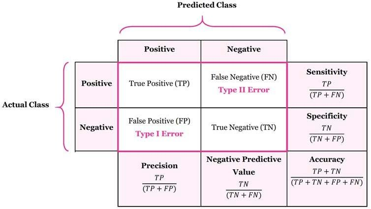

# 💰 Loan Approval Prediction Portal

> **A machine learning web app that predicts loan approval decisions for Pakistani bank applicants using Logistic Regression — built with Scikit-learn and Streamlit.**


---

## 🚀 Live Demo
🔗 [View Live App](https://loan-approval-application09.streamlit.app/)

---

## 📸 Screenshots


---

## 🧠 Overview
This app predicts whether a Pakistani bank loan applicant will be **approved or rejected** based on their financial and personal profile. Built using a **Logistic Regression pipeline** with full preprocessing — imputation, scaling, and one-hot encoding — trained and evaluated directly within the Streamlit app.

---

## ✨ Features
- Upload any loan CSV dataset and train the model instantly
- Full ML pipeline — imputation + scaling + encoding + classification
- Real-time loan approval prediction with probability score
- Model performance metrics — Accuracy, Precision, Recall, F1
- Confusion matrix displayed as interactive table
- Pakistan-specific features — PKR income, Pakistani banks and cities
- Dataset preview with first 20 rows

---

## 🏗️ ML Pipeline

```
Loan Dataset (CSV)
        ↓
Train/Test Split (80/20, stratified)
        ↓
Numeric Features → SimpleImputer (median) + StandardScaler
Categorical Features → SimpleImputer (most_frequent) + OneHotEncoder
        ↓
Logistic Regression (max_iter=2000)
        ↓
Evaluation: Accuracy, Precision, Recall, F1, Confusion Matrix
        ↓
Real-time Prediction on New Applicant
```

---

## 📊 Input Features

| Feature | Description |
|---|---|
| Age | Applicant age (21–60) |
| Gender | Male / Female |
| City | Pakistani city |
| Employment Type | Employment category |
| Bank | Applicant's bank |
| Monthly Income (PKR) | Monthly income in PKR |
| Credit Score | Credit score (300–850) |
| Loan Amount (PKR) | Requested loan amount |
| Loan Tenure (Months) | 6 to 60 months |
| Existing Loans | Number of existing loans (0–3) |
| Default History | Previous loan defaults |
| Has Credit Card | Credit card ownership |

---

## 🧰 Tech Stack
| Tool | Purpose |
|---|---|
| Scikit-learn | ML pipeline, preprocessing, Logistic Regression |
| Pandas + NumPy | Data handling |
| Streamlit | Interactive web interface |

---

## 📁 Project Structure
```
Loan-Approval-Streamlit-app/
├── loan.py                     # Full ML pipeline + Streamlit UI
├── loan_dataset.csv            # Loan dataset
├── Matrix_evaluation.png       # Confusion matrix screenshot
├── train_test_split_idea.xlsx  # Split reference
├── requirements.txt
└── README.md
```

---

## ⚙️ Run Locally
```bash
git clone https://github.com/maryamasifaziz/Loan-Approval-Streamlit-app
cd Loan-Approval-Streamlit-app
pip install -r requirements.txt
streamlit run loan.py
```

---

## 👤 Author
**Maryam Asif**  
🎓 FAST NUCES  
🔗 [LinkedIn](https://linkedin.com/maryamasifaziz) | [GitHub](https://github.com/maryamasifaziz)
